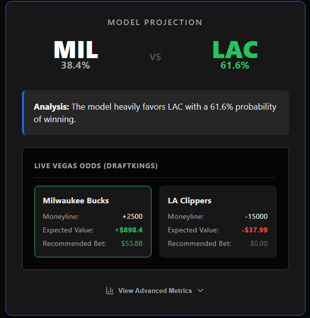
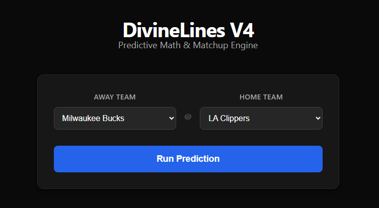
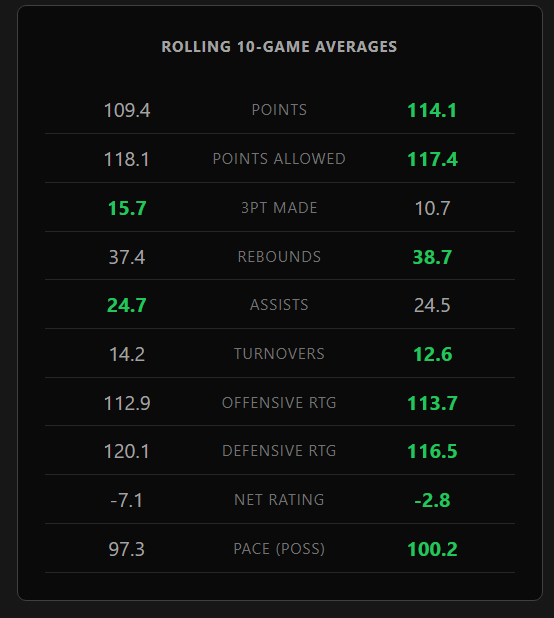
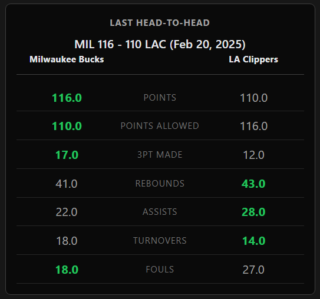

# DivineLines

> High-end quantitative sports analytics and risk management in one experience.

<div align="center">
  
  <p><em>Analyze matchups, identify market inefficiencies, and optimize your betting bankroll.</em></p>
</div>

## Description

DivineLines blends real-time sportsbook market data with an AI-powered XGBoost predictive engine so you can see both the mathematical probabilities and the financial edge. Select any NBA matchup, view the latest live Vegas odds, and manage your risk with Kelly Criterion stake recommendations from a modern dashboard.

## Product Tour

<div align="center">
  
</div>

- **The Predictive Engine** – Select a matchup to get a curated win probability generated by a model trained on 5+ years of pace-adjusted NBA data.
- **Quantitative Edge Dashboard** – See real-time Moneyline odds, Expected Value (+EV), and an automated Fractional Kelly stake recommendation scaled to your unit size.

### Advanced Statistical Tracking

The engine doesn't just look at wins and losses; it recalculates rolling 10-game efficiency metrics and historical head-to-head matchups to find hidden edges.

<table border="0" align="center">
  <tr>
    <td>
      
    </td>
    <td>
      
    </td>
  </tr>
</table>

## 🚀 The Stack

- **Frontend:** React, TypeScript, Vite
- **Backend:** FastAPI, Python, XGBoost, The-Odds-API
- **Data:** SQLite, pandas, Custom ETL Pipeline (`refresh_data.py`)

---

## Getting Started

First, ensure you have added your `.env` file with your `ODDS_API_KEY` to the `src` folder. This project requires two active terminals to run the frontend and backend simultaneously.

**1. Start the Backend (API)**
Navigate to the source directory and launch the FastAPI server:

```bash
cd src
python api.py
```

**2. Start the Frontend (UI)**
Open a new terminal window, navigate to the frontend directory, and run the development server:

```bash
cd frontend
npm install
npm run dev
```

Open http://localhost:5173 with your browser to see the result. The backend API will run concurrently on port 8000.
